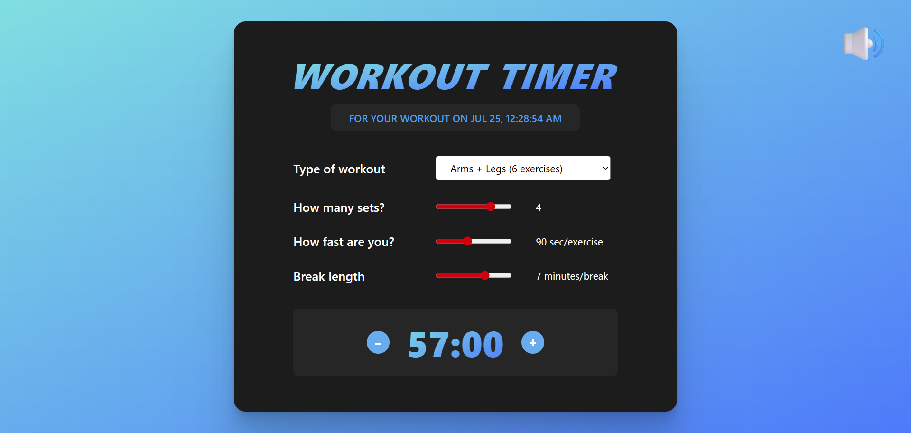

# ⏱️ Workout Timer App

A customizable fitness timer app built with React. It lets you select different types of workouts, configure sets, speed, and break durations, and automatically calculates total workout time.

---

## 🌐 Live Demo

👉 [Try the live Application](https://nkieu-workout-timer.vercel.app/)

---

## 📸 Screenshots



---

## ✨ Key Features

- 🧮 **Dynamic Workout Calculator** – Select workout type, number of sets, speed (seconds per exercise), and break time.
- 🔄 **Real-Time Clock** – Displays current time and updates every second using `setInterval`.
- 🧠 **Smart Defaults Based on Time of Day** – Morning and evening affect available workouts.
- 🔊 **Sound Feedback** – Play a click sound when workout duration updates.
- 🧠 **Performance Optimizations** – Efficient with `useMemo`, `useCallback`, and `memo`.

---

## 🧠 Learning Objectives

This app reinforces key React concepts:

### ✅ React State Management

- Use of `useState` for handling local UI states like workout options and timing.
- Timer updates with `useEffect`.

### ✅ Side Effects

- Document title updates dynamically to reflect workout plan.
- Sound effects triggered using `useEffect`.

### ✅ Performance Optimization

- `useMemo` to memoize workout configurations and prevent unnecessary recalculations.
- `useCallback` (commented for optional use) and `memo` for preventing unnecessary re-renders of components like `ToggleSounds` and `Calculator`.

---

## 🛠️ Technology Stack

| Technology      | Description                              |
| --------------- | ---------------------------------------- |
| **JavaScript**  | Modern ES6+ features                     |
| **React**       | JavaScript UI library (v19.1)            |
| **Vite**        | Modern build tool and fast dev server    |

---

## 🚀 Installation & Setup

1. **Clone the repository**

```bash
git clone https://github.com/nkieu-config/workout-timer-app-project.git
```

2. **Install dependencies**

```bash
npm install
```

3. **Start the development server**

```bash
npm run dev
```

---

## 📚 Course Credit

This project was built as part of **[The Ultimate React Course 2025](https://www.udemy.com/course/the-ultimate-react-course/)** by [Jonas Schmedtmann](https://codingheroes.io/)

---

## 📃 License

This is a personal learning project and not intended for commercial or production use.
